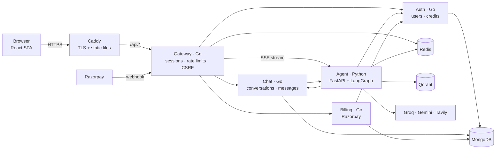
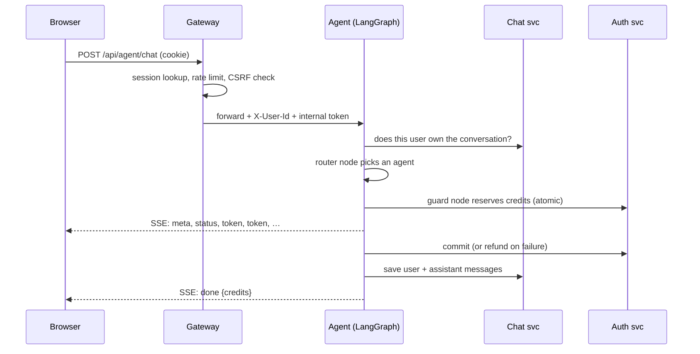

# CortexAI

A multi-agent AI assistant. One chat box routes each request to the right specialist agent: conversation, live web search, coding (with a live preview), questions about your own PDFs, image understanding, and generation of PDF reports, PowerPoint decks and images. It has streaming answers, credit-based billing and Google sign-in.

**Stack:** Go (gateway, auth, chat and billing services) · Python (FastAPI + LangGraph agent service) · React · MongoDB · Redis · Qdrant · **Google Cloud Run** · Secret Manager · Cloud Storage · GitHub Actions CD · Docker

> Live demo: `https://cortex-gateway-<project-number>.<region>.run.app` · Payments run in Razorpay **test mode**, so no real money moves.

---

## Features

| Agent | What it does | Powered by |
|---|---|---|
| Chat | General conversation with memory | gpt-oss-120b on Groq |
| Search | Answers from fresh web results with numbered citations | Tavily + LLM |
| Coding | Builds multi-file projects (live HTML/CSS/JS preview), or reviews/explains code | LLM + artifact panel |
| Document Q&A (RAG) | Upload a PDF, ask questions, get answers citing page numbers | Gemini embeddings + Qdrant |
| Vision | Explains, transcribes and analyses uploaded images | Gemini 2.5 Flash |
| PDF / Slides | Generates styled PDF reports and 16:9 PowerPoint decks | Structured LLM output + ReportLab / python-pptx |
| Image | Generates images from a description | Prompt rewriting + image API |

In **Auto** mode, a small, fast model classifies each message and picks the agent. An uploaded image goes straight to Vision, and an uploaded PDF goes to Document Q&A.

## Architecture



- **Only the gateway is public.** On Cloud Run, the internal services accept only callers holding a Google identity token for a service account granted `roles/run.invoker` on that specific service; the grants mirror the call graph. Locally (Docker Compose), they sit on a private network instead. In both cases every service also requires a shared `X-Internal-Token`, so it can trust the `X-User-Id` header that only the gateway sets.
- **Production runs on Google Cloud Run.** Each service scales to zero and has its own service account. Secrets come from Secret Manager, files live in Cloud Storage, and GitHub Actions deploys on every green push to `main` using keyless Workload Identity Federation. The diagram above shows the Docker Compose layout; [docs/DEPLOYMENT.md](docs/DEPLOYMENT.md) shows the Cloud Run one.
- **Go for the platform, Python for the AI.** The request-heavy platform services (sessions, proxying, payments, CRUD) are small, fast Go binaries. The agent service is Python because LangGraph, LangChain and the document libraries live there.

### One chat turn



## Repository layout

```
backend/            Go module: gateway, auth, chat, billing
  cmd/<service>/    main packages
  internal/         service code + shared platform packages
agent/              Python agent service
  app/graph/        LangGraph state, router + guard nodes, graph
  app/agents/       chat, search, coding, rag, vision, pdf/ppt/image
  app/documents/    PDF and PowerPoint renderers
frontend/           React + Vite + Tailwind SPA
deploy/Caddyfile    HTTPS, static files, /api proxy
docs/               design notes and deployment guide
docker-compose.yml  the whole stack
```

## Run it locally

**Everything in Docker** (you need Docker Desktop):

```bash
cp .env.example .env   # fill in the keys; see docs/DEPLOYMENT.md
docker compose up -d --build
```

Then open http://localhost. Keep `SITE_ADDRESS=http://localhost` and `COOKIE_SECURE=false` for local use.

**Hot-reload development:** run only the databases in Docker and the services natively.

```bash
docker compose -f docker-compose.yml -f docker-compose.dev.yml up -d mongo redis qdrant
```

| Service | Command (from its folder) | Port |
|---|---|---|
| auth | `go run ./cmd/auth` | 8081 |
| chat | `go run ./cmd/chat` | 8082 |
| billing | `go run ./cmd/billing` | 8083 |
| gateway | `go run ./cmd/gateway` | 8080 |
| agent | `uv run uvicorn app.main:app --reload --port 8084` | 8084 |
| frontend | `npm run dev` (proxies `/api` to 8080) | 5173 |

Each service reads its settings from environment variables; `docs/DEPLOYMENT.md` lists them.

## Tests

```bash
cd backend  && go test ./...                        # unit tests
cd backend  && MONGODB_TEST_URI=mongodb://localhost:27017 go test -tags integration ./...
cd agent    && uv run pytest
cd frontend && npm run lint && npm run build
```

CI (GitHub Actions) runs all of these, the Go tests with the race detector and a real MongoDB, and then builds every Docker image.

The tests focus on the parts where bugs cost money or leak data:
- A user can't read or modify another user's conversations or files.
- Spoofed `X-User-Id` headers are replaced.
- `/internal` routes are never reachable through the gateway.
- 50 concurrent requests can't overspend 10 credits.
- A replayed payment, or a payment signed for someone else's order, grants nothing.
- Forged Razorpay webhooks and forged JWTs (including algorithm confusion) are rejected.
- Failed agent runs are refunded.
- The full streaming pipeline, from router through guard and agent to persistence, runs end to end with a fake LLM.

## Security highlights

- Server-side sessions in Redis store only a SHA-256 hash of the token. The cookie is `HttpOnly`, `SameSite=Lax` and `Secure`, and the session is rotated on every login.
- A custom `X-Requested-With` header is required on every write request (CSRF defence in depth).
- Firebase ID tokens are verified directly against Google's public keys, with audience, issuer, expiry, `auth_time` and RS256-only checks. **No service-account secret is needed.**
- Credits change only through atomic MongoDB updates with guards (`credits >= cost`). Purchases are idempotent, keyed by order ID, and fulfilled by whichever arrives first: the signed webhook or the browser's verify call.
- Uploads are type-checked by magic bytes, never by filename or `Content-Type`. Files are stored under `userId/conversationId/…` and served only to their owner.
- Rate limits apply per IP (login) and per user (API and each agent), and a global daily budget caps usage.
- The containers are distroless and run as non-root users. Only ports 80 and 443 are exposed.

More detail, including the trade-offs and what I'd do next, is in [docs/DESIGN.md](docs/DESIGN.md).

## Deploying

- **Google Cloud Run (primary):** [docs/DEPLOYMENT.md](docs/DEPLOYMENT.md). Runs within free tiers (about $0–1 a month) and deploys automatically from GitHub Actions.
- **Any single VM with Docker Compose:** [docs/DEPLOYMENT-VM.md](docs/DEPLOYMENT-VM.md), for example an Oracle Cloud Always-Free VM with a DuckDNS domain and Caddy HTTPS.
