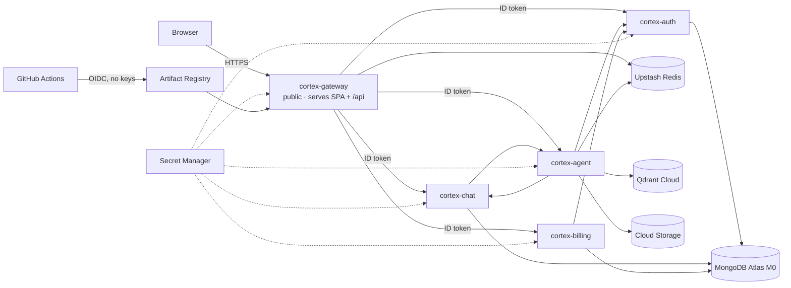

# Deploying CortexAI to Google Cloud Run

This guide deploys the five services to **Cloud Run** (serverless containers that scale to zero), backed by free managed data services.
- **Terraform** (`infra/`) defines all of the infrastructure.
- **Code deploys are automatic:** every push to `main` that passes CI is built and rolled out by GitHub Actions.
- **No key file exists anywhere:** GitHub Actions authenticates to Google with **Workload Identity Federation**.



Only `cortex-gateway` is public. The other four services reject any request that lacks an identity token from a service account granted `roles/run.invoker` on that specific service; Google's front end enforces this. The grants mirror the call graph exactly.

## What it costs

| Piece | Free allowance | This project |
|---|---|---|
| Cloud Run | 2M requests, 180k vCPU-seconds and 360k GiB-seconds per month | Demo traffic stays inside it; instances scale to zero |
| Artifact Registry | 0.5 GB storage | A cleanup policy keeps the 3 newest images per service; may slightly exceed it (cents) |
| Secret Manager | 6 active secret versions | 7–10 secrets, so roughly $0.25/month |
| Cloud Storage | 5 GB, but only in `us-*` regions | A few MB in your region plus the Terraform state, costing cents |
| MongoDB Atlas M0, Upstash Redis, Qdrant Cloud | Free tiers | $0 |

Realistically this is **$0–1 a month**. Google requires a billing account (a card) even for free-tier use, so **set a budget alert** (step 7). Every service is capped at 2 instances.

The trade-off is **cold starts**. After a period of no traffic, the first request waits a few seconds for containers to start, longest for the Python agent. The UI shows a "waking up" message.

---

## 1. Accounts and keys

Create these first. They're all free.

1. **Firebase** (https://console.firebase.google.com):
   1. Create a project (Google Analytics isn't needed).
   2. Go to **Authentication → Sign-in method → Google → Enable**.
   3. Go to **Project settings → Your apps → Add web app**, then copy `apiKey`, `authDomain`, `projectId` and `appId`.
2. **Groq** (https://console.groq.com/keys), **Google AI Studio** (https://aistudio.google.com/apikey) and **Tavily** (https://app.tavily.com): create API keys.
3. **Razorpay** (https://dashboard.razorpay.com): stay in **Test mode**, then go to **API Keys → Generate test key**.
4. **MongoDB Atlas** (https://cloud.mongodb.com):
   1. Create a free **M0** cluster, choosing **Google Cloud** and the region closest to your Cloud Run region.
   2. Under **Database Access**, add a user with a strong generated password.
   3. Under **Network Access**, add `0.0.0.0/0`. Cloud Run has no fixed outbound IP without a paid NAT, so the strong password is the protection here.
   4. Under **Connect → Drivers**, copy the `mongodb+srv://…` URI.
5. **Upstash** (https://console.upstash.com): create a Redis database in the region nearest yours, then copy the `rediss://…` URL. Note the double **s**, which means TLS.
6. **Qdrant Cloud** (https://cloud.qdrant.io): create a free cluster, then copy its URL (ending in `:6333`) and an API key. Free clusters can be suspended after long inactivity; check their current policy.

## 2. Google Cloud project

1. Go to https://console.cloud.google.com and create a project, for example `cortex-ai-yourname`. Link a billing account; new accounts also get trial credit.
2. Open **Cloud Shell** (the `>_` icon, top right). It already has `gcloud`, `docker` and `terraform`.

## 3. Fill in the configuration

In Cloud Shell:

```bash
git clone https://github.com/<you>/cortex-ai.git
```

```bash
cd cortex-ai
```

Two committed files hold the settings. Neither contains secrets:

- **`infra/terraform.tfvars`**: the project id and number, region, `github_repo` (as `owner/name`), a globally unique `gcs_bucket`, `firebase_project_id`, `razorpay_key_id`, `qdrant_url`, and the list of `secrets` you'll provide.
- **`deploy/gcp/config.env`**: the project id and number, region, and the Firebase web values that get baked into the frontend build.

Find the project number with:

```bash
gcloud projects describe <project-id> --format='value(projectNumber)'
```

Then create **`deploy/gcp/secrets.env`**, which is **never committed**:

```bash
cp deploy/gcp/secrets.env.example deploy/gcp/secrets.env
```

Fill in the Mongo, Redis and Qdrant values plus the API keys. Generate `INTERNAL_TOKEN` with:

```bash
openssl rand -hex 32
```

## 4. Bootstrap, then Terraform

**Bootstrap** does the two things Terraform can't: it creates the bucket for Terraform's own state, and uploads secret values. Values never pass through Terraform, so they never land in its state file.

```bash
bash deploy/gcp/bootstrap.sh
```

```bash
rm deploy/gcp/secrets.env
```

**Terraform** creates everything else from `infra/`:
- The APIs and the Artifact Registry repo (with a cleanup policy).
- One service account per service.
- Secret access, so each service can read only its own secrets.
- The private bucket.
- The five Cloud Run services, and which service may call which.
- The keyless GitHub deploy trust.

For a **brand-new project**, delete `infra/imports.tf` first. It's only for adopting resources that already exist (see "Adopting Terraform" below).

```bash
cd infra
```

```bash
terraform init -backend-config="bucket=<project-id>-tfstate"
```

```bash
terraform plan -out tf.plan
```

Read the plan, then apply it:

```bash
terraform apply tf.plan
```

Commit the `.terraform.lock.hcl` file that `init` creates. It pins the provider version.

New services start with Google's "hello" placeholder image until the first code deploy.

## 5. First deploy

Push to `main`. GitHub Actions runs the tests and validates the Terraform. Then the **Deploy to Cloud Run** job builds all five images, pushes them and rolls each service onto its new image.

You can also deploy straight from Cloud Shell:

```bash
bash deploy/gcp/deploy.sh
```

Your site is:

```
https://cortex-gateway-<PROJECT_NUMBER>.<REGION>.run.app
```

## 6. Connect Firebase and Razorpay to the live URL

- **Firebase:** go to **Authentication → Settings → Authorized domains → Add domain** and enter `cortex-gateway-<PROJECT_NUMBER>.<REGION>.run.app`.
- **Razorpay** (test mode): go to **Webhooks → Add**:
  1. Set the URL to `https://cortex-gateway-…run.app/api/billing/webhook`.
  2. Choose the events `payment.captured` and `payment.failed`.
  3. Pick a secret and put it in `secrets.env` as `RAZORPAY_WEBHOOK_SECRET`, then run `bootstrap.sh`.
  4. Add `"razorpay-webhook-secret"` to `secrets` in `terraform.tfvars`, then run `terraform apply`.

Open the site, sign in and send a message. To test a purchase in test mode, choose **Netbanking**, pick any bank and click **Success**. UPI isn't always offered in test checkout.

## 7. Cost guardrail (do this)

In the console, go to **Billing → Budgets & alerts → Create budget**. Choose this project, set an amount of ₹100 (or $1), and turn on email alerts at 50%, 90% and 100%.

## Who owns what

| Change | Where | How it ships |
|---|---|---|
| Code | `backend/`, `agent/`, `frontend/` | Push to `main`; CI builds images and runs `gcloud run services update --image` |
| Service settings (env vars, models, memory, scaling, IAM, which secrets exist) | `infra/*.tf`, `terraform.tfvars` | `terraform plan` / `terraform apply` from Cloud Shell |
| Secret values | `secrets.env` → Secret Manager | `bootstrap.sh`. New revisions pick up `latest` on the next deploy. |

Terraform ignores each service's image, and CI changes nothing but the image, so the two never overwrite each other. CI only **validates** Terraform; it doesn't plan or apply. Planning needs read access to all IAM and secret metadata, and the CI deployer is deliberately limited to pushing images and rolling out revisions (`roles/run.developer`).

## Adopting Terraform (deployments created with the old setup.sh)

Earlier versions of this repo created the infrastructure with `setup.sh` and `gcloud run deploy`. `infra/imports.tf` adopts those existing resources into Terraform state, without recreating anything.

1. In Cloud Shell, pull the latest code. Make sure the `secrets` list in `terraform.tfvars` matches what exists:

   ```bash
   gcloud secrets list --format='value(name)'
   ```

2. Run bootstrap once to create the state bucket. Without a `secrets.env` it skips secrets:

   ```bash
   bash deploy/gcp/bootstrap.sh
   ```

3. Initialise and plan:

   ```bash
   cd infra
   ```

   ```bash
   terraform init -backend-config="bucket=<project-id>-tfstate"
   ```

   ```bash
   terraform plan -out tf.plan
   ```

4. **Read the plan.** Expected:
   - About 25 resources to **import**.
   - New IAM members to **add**. They already exist in GCP, so adding them is a no-op.
   - A few in-place **updates** to the Cloud Run services, such as env var ordering. Each produces a new revision with no downtime.

   **Stop if anything says `destroy` or `must be replaced`**, and investigate first. The bucket and secrets have `prevent_destroy`, and the services have deletion protection, so a mistake fails loudly instead of deleting data.

5. Apply it:

   ```bash
   terraform apply tf.plan
   ```

6. Optional cleanup: the old script gave the CI deployer broader roles than it needs. Terraform grants `roles/run.developer`, so remove the leftovers:

   ```bash
   gcloud projects remove-iam-policy-binding <project-id> --member serviceAccount:cortex-deployer@<project-id>.iam.gserviceaccount.com --role roles/run.admin
   ```

   ```bash
   gcloud projects remove-iam-policy-binding <project-id> --member serviceAccount:cortex-deployer@<project-id>.iam.gserviceaccount.com --role roles/secretmanager.viewer
   ```

## Operating it

**Logs:** in the console go to **Cloud Run → service → Logs**, or run:

```bash
gcloud run services logs read cortex-agent --region asia-south1 --limit 50
```

Every entry is JSON with a `severity` and a `request_id` that's shared across services.

- **Rollback:** go to **Cloud Run → service → Revisions** and route traffic to an earlier revision.
- **Limits and models** are set in `terraform.tfvars` (`starting_credits`, `daily_request_cap`, `models`, `max_instances`, `agent_min_instances`), then `terraform apply`.

### Troubleshooting

| Symptom | Fix |
|---|---|
| CI deploy fails with a permission error | Check that `terraform apply` has run; it grants the deployer its roles. Also check that `github_repo` in `terraform.tfvars` exactly matches `owner/name`. |
| `terraform plan` wants to replace something | Don't apply. Compare that resource's settings in GCP with the `.tf` file and make the code match reality. |
| A service won't start | Check its Cloud Run logs. A startup error names any missing env var, or the Mongo/Redis connection failure. |
| `auth/unauthorized-domain` at sign-in | Add the run.app domain in Firebase (step 6). |
| 502 "Service is temporarily unavailable" | An internal service is failing or cold. Check its logs. A 403 there means a missing `roles/run.invoker` grant, so run `terraform apply`. |
| First request is very slow | That's a cold start, expected when scaling to zero. Set `agent_min_instances = 1` to keep the agent warm (costs money). |

## Local development

Nothing changes for local work: `docker compose up` runs everything on your machine exactly as before (see the README). `SERVICE_AUTH` defaults to `none`, and storage defaults to a local volume.
