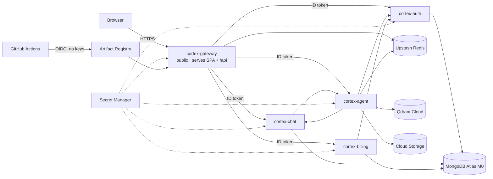

# Deploying CortexAI to Google Cloud Run

This guide deploys the five services to **Cloud Run** (serverless containers that scale to zero), backed by free managed data services. Deploys are automatic: every push to `main` that passes CI is built and deployed by GitHub Actions, which authenticates to Google with **Workload Identity Federation**, so no key file exists anywhere.



Only `cortex-gateway` is public. The other four are deployed with `--no-allow-unauthenticated`, so Google's front end rejects any request without an identity token from a service account granted `roles/run.invoker` on that specific service. The grants mirror the call graph exactly.

## What it costs

| Piece | Free allowance | This project |
|---|---|---|
| Cloud Run | 2M requests, 180k vCPU-seconds and 360k GiB-seconds per month | Demo traffic stays inside it; instances scale to zero |
| Artifact Registry | 0.5 GB storage | A cleanup policy keeps the 3 newest images per service; may slightly exceed it (cents) |
| Secret Manager | 6 active secret versions | 7–10 secrets, so roughly $0.25/month |
| Cloud Storage | 5 GB, but only in `us-*` regions | A few MB in your region, costing cents |
| MongoDB Atlas M0, Upstash Redis, Qdrant Cloud | Free tiers | $0 |

Realistically this is **$0–1 a month**. Google requires a billing account (a card) even for free-tier use, so **set a budget alert** (step 7). Every service is capped at 2 instances.

The trade-off is **cold starts**. After a period of no traffic, the first request waits a few seconds for containers to start, longest for the Python agent. The UI shows a "waking up" message.

---

## 1. Accounts and keys

Create these first. They're all free.

1. **Firebase** (https://console.firebase.google.com):
   1. Create a project (Google Analytics isn't needed).
   2. Go to **Authentication → Sign-in method → Google → Enable**.
   3. Go to **Project settings → Your apps → Add web app**, then copy `apiKey`, `authDomain`, `projectId` and `appId`.
2. **Groq** (https://console.groq.com/keys), **Google AI Studio** (https://aistudio.google.com/apikey) and **Tavily** (https://app.tavily.com): create API keys.
3. **Razorpay** (https://dashboard.razorpay.com): stay in **Test mode**, then go to **API Keys → Generate test key**.
4. **MongoDB Atlas** (https://cloud.mongodb.com):
   1. Create a free **M0** cluster, choosing **Google Cloud** and the region closest to your Cloud Run region.
   2. Under **Database Access**, add a user with a strong generated password.
   3. Under **Network Access**, add `0.0.0.0/0`. Cloud Run has no fixed outbound IP without a paid NAT, so the strong password is the protection here.
   4. Under **Connect → Drivers**, copy the `mongodb+srv://…` URI.
5. **Upstash** (https://console.upstash.com): create a Redis database in the region nearest yours, then copy the `rediss://…` URL. Note the double **s**, which means TLS.
6. **Qdrant Cloud** (https://cloud.qdrant.io): create a free cluster, then copy its URL (ending in `:6333`) and an API key. Free clusters can be suspended after long inactivity; check their current policy.

## 2. Google Cloud project

1. Go to https://console.cloud.google.com and create a project, for example `cortex-ai-yourname`. Link a billing account; new accounts also get trial credit.
2. Open **Cloud Shell** (the `>_` icon, top right). It already has `gcloud` and `docker`, and it's the easiest place to run the setup.

## 3. Fill in the configuration

In Cloud Shell:

```bash
git clone https://github.com/<you>/cortex-ai.git
```

```bash
cd cortex-ai
```

Edit **`deploy/gcp/config.env`** with `PROJECT_ID`, `REGION`, `GITHUB_REPO` (as `owner/name`), a globally unique `GCS_BUCKET`, the Firebase web values, `RAZORPAY_KEY_ID` and `QDRANT_URL`. None of these are secret, so this file is committed.

Then create **`deploy/gcp/secrets.env`**, which is **never committed**:

```bash
cp deploy/gcp/secrets.env.example deploy/gcp/secrets.env
```

Fill in the Mongo, Redis and Qdrant values plus all the API keys. Generate `INTERNAL_TOKEN` with:

```bash
openssl rand -hex 32
```

## 4. One-time setup

```bash
bash deploy/gcp/setup.sh
```

This enables the APIs and creates:
- The Artifact Registry repo.
- One service account per service.
- The secrets, each readable only by the services that need it.
- The private bucket.
- The GitHub keyless-deploy trust.

At the end it prints your **`PROJECT_NUMBER`**. Put that in `config.env`.

Once setup is done, delete the local secrets file. The values now live in Secret Manager:

```bash
rm deploy/gcp/secrets.env
```

To change a secret later, recreate the file and run `setup.sh` again. It only adds a new version when a value changed.

## 5. First deploy

Commit `config.env` and push to `main`. GitHub Actions runs the tests, then the **Deploy to Cloud Run** job builds all five images, pushes them and deploys.

You can also deploy straight from Cloud Shell:

```bash
bash deploy/gcp/deploy.sh
```

Your site is:

```
https://cortex-gateway-<PROJECT_NUMBER>.<REGION>.run.app
```

## 6. Connect Firebase and Razorpay to the live URL

- **Firebase:** go to **Authentication → Settings → Authorized domains → Add domain** and enter `cortex-gateway-<PROJECT_NUMBER>.<REGION>.run.app`.
- **Razorpay** (test mode): go to **Webhooks → Add**. Set the URL to `https://cortex-gateway-…run.app/api/billing/webhook` and choose the events `payment.captured` and `payment.failed`. Pick a secret, add it as `RAZORPAY_WEBHOOK_SECRET` in `secrets.env`, then re-run `setup.sh` and `deploy.sh`.

Open the site, sign in and send a message. To test a purchase, pay with UPI ID `success@razorpay`.

## 7. Cost guardrail (do this)

In the console, go to **Billing → Budgets & alerts → Create budget**. Choose this project, set an amount of ₹100 (or $1), and turn on email alerts at 50%, 90% and 100%.

## Operating it

**Logs:** in the console go to **Cloud Run → service → Logs**, or run:

```bash
gcloud run services logs read cortex-agent --region asia-south1 --limit 50
```

Every line is JSON with a `request_id` that's shared across services.

- **Rollback:** go to **Cloud Run → service → Revisions** and route traffic to an earlier revision.
- **Limits** live in `config.env`: `STARTING_CREDITS` and `DAILY_REQUEST_CAP`. `--max-instances` is set in `deploy.sh`.

### Troubleshooting

| Symptom | Fix |
|---|---|
| A deploy step fails with a permission error | Re-run `setup.sh`; it's idempotent. Make sure `GITHUB_REPO` exactly matches `owner/name`. |
| A service won't start | Check its Cloud Run logs. A startup error names any missing env var, or the Mongo/Redis connection failure. |
| `auth/unauthorized-domain` at sign-in | Add the run.app domain in Firebase (step 6). |
| 502 "Service is temporarily unavailable" | An internal service is failing or cold. Check its logs. A 403 there means a missing `roles/run.invoker` grant, so re-run `deploy.sh`. |
| First request is very slow | That's a cold start. It's expected when scaling to zero. |

## Local development

Nothing changes for local work: `docker compose up` runs everything on your machine exactly as before (see the README). `SERVICE_AUTH` defaults to `none`, and storage defaults to a local volume.
